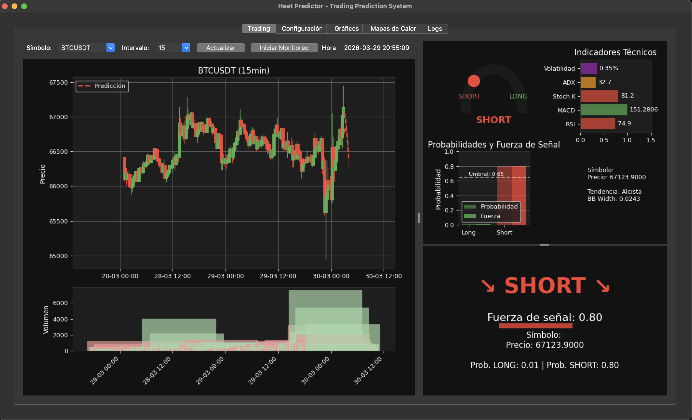

# Heat Predictor - Trading Prediction System 🚀

Sistema de predicción de mercado multi-exchange basado en Machine Learning - **Totalmente Gratis**



---

## 🎯 Descripción

Heat Predictor - Trading Prediction System es un sistema de trading algorítmico que combina:

- ✅ **Análisis técnico avanzado** con indicadores personalizados
- ✅ **Análisis del libro de órdenes** en tiempo real
- ✅ **Sistema anti-spoofing** para detectar manipulación
- ✅ **Machine Learning (Gradient Boosting)** para predicción
- ✅ **Indicador propio de TradingView** implementado en Python

**Enfoque:** Operaciones de futuros con entradas del **0.30% - 1%** tanto en LONG como en SHORT.

---

## 📋 Requisitos

- **Python 3.12+** (requerido para compatibilidad con tkinter en macOS)
- **Sistema Operativo:** Windows, Linux o macOS
- **Entorno virtual:** Aislado para cada instalación

---

## 🛠️ Instalación

### 🪟 Windows

#### 1. Instalar Python 3.12

Descarga desde: [python.org/downloads](https://www.python.org/downloads/)

✅ Asegúrate de marcar: **"Add Python to PATH"** durante la instalación

#### 2. Crear entorno virtual

```cmd
cd PyPrediccionBybit
python3.12 -m venv .venv
.venv\Scripts\activate
```

#### 3. Verificar instalación

```cmd
python -V
# Debe mostrar: Python 3.12.x
```

#### 4. Actualizar pip

```cmd
python -m pip install --upgrade pip
python -m pip install --upgrade setuptools
```

#### 5. Instalar dependencias

```cmd
pip install -r requirements.txt
```

#### 6. Ejecutar aplicación

```cmd
python app_principal.py
```

---

### 🐧 Linux / 🍎 macOS

#### 1. Instalar Python 3.12

**macOS:**
```bash
brew install python@3.12
brew install python-tk@3.12
```

**Ubuntu/Debian:**
```bash
sudo apt update
sudo apt install python3.12 python3.12-venv python3.12-tk
```

**Fedora:**
```bash
sudo dnf install python3.12 python3.12-tkinter
```

#### 2. Crear entorno virtual

```bash
cd PyPrediccionBybit
python3.12 -m venv .venv
source .venv/bin/activate
```

#### 3. Verificar instalación

```bash
python -V
# Debe mostrar: Python 3.12.x
```

#### 4. Actualizar pip

```bash
python -m pip install --upgrade pip
python -m pip install --upgrade setuptools
```

#### 5. Instalar dependencias

```bash
pip install -r requirements.txt
```

#### 6. Ejecutar aplicación

```bash
python app_principal.py
```

---

## 📦 Librerías Requeridas

Las dependencias se instalan automáticamente con `requirements.txt`:

```bash
pip install -r requirements.txt
```

**Incluye:**
- `matplotlib` - Gráficos y visualizaciones
- `pandas` - Manipulación de datos
- `numpy` - Cálculo numérico
- `seaborn` - Visualizaciones estadísticas
- `requests` - Conexión API exchange
- `pytz` - Manejo de zonas horarias
- `scikit-learn` - Machine Learning (Gradient Boosting)

---

## 🚀 Guía de Inicio Rápido

### Paso 1: Ejecutar la Aplicación

```bash
python app_principal.py
```

---

### Paso 2: Configurar API de Exchange

1. **Ir a la pestaña "Configuración"** en la interfaz gráfica

2. **Agregar API Key:**
   - Ingresa tu **API Key** del exchange
   - Ingresa tu **API Secret**

3. **Presionar "Guardar Configuración"**
   - ✅ La configuración se guarda permanentemente
   - 📁 Ubicación:
     - **Windows:** `%USERPROFILE%\.pyprediccion\config.json`
     - **Linux/macOS:** `~/.pyprediccion/config.json`
   - 🔒 No necesitas volver a ingresar las credenciales

---

### Paso 3: Entrenar Modelos

1. **Ir a la pestaña "Trading"**

2. **Presionar "Entrenar Modelos"**
   - ⏱️ Tiempo estimado: 5-10 segundos
   - 📊 El sistema entrena los modelos de Gradient Boosting
   - ✅ Verás: "Modelos entrenados. Long acc: XX%, Short acc: XX%"

---

### Paso 4: Actualizar Pares

1. **Presionar "Actualizar Pares"**
   - 🔄 Carga la lista de pares disponibles en el exchange
   - 📈 Muestra: "Lista de pares actualizada, XX pares disponibles"

---

### Paso 5: Iniciar Monitoreo

1. **Presionar "Iniciar Monitoreo"**
   - ▶️ El sistema comienza a analizar el mercado en tiempo real
   - 📊 Actualiza datos cada pocos segundos
   - 🎯 Muestra predicciones LONG/SHORT con probabilidades
   - 🔔 Alertas cuando se detectan oportunidades

---

## 📊 Características del Sistema

| Característica | Descripción |
|---------------|-------------|
| **Anti-Spoofing** | Detecta y filtra manipulación del libro de órdenes |
| **Análisis Libro de Órdenes** | Procesa orderbook en tiempo real |
| **Indicador Personalizado** | Implementación Python del indicador de TradingView |
| **Machine Learning** | Gradient Boosting Classifier para predicción LONG/SHORT |
| **Multi-Timeframe** | Soporte para múltiples intervalos (1m, 5m, 15m, 30m, 1h, 4h) |
| **Configuración Persistente** | Guarda API keys y preferencias automáticamente |

---

## 🎓 Tasa de Éxito

El sistema está diseñado para:

- 🎯 **Entradas aseguradas:** 0.30% - 1% de movimiento
- 📈 **Direccionalidad:** Funciona tanto en subida (LONG) como en bajada (SHORT)
- ⚡ **Enfoque:** Operaciones de futuros
- 🤖 **Automatización:** Monitoreo continuo sin intervención manual

---

## 📁 Estructura del Proyecto

```
PyPrediccionBybit/
├── app_principal.py        # Aplicación principal (interfaz gráfica)
├── bybit_api.py            # Conexión con API exchange
├── analizador_datos.py     # Análisis de datos e indicadores
├── visualizaciones.py      # Gráficos y visualizaciones
├── test_qa.py              # Tests automatizados de QA
├── requirements.txt        # Dependencias de Python
├── utils/
│   └── config_manager.py   # Gestor de configuración persistente
└── local_work/             # Documentación y trabajo local
    ├── plan_config_persistente.md
    └── problemas_encontrados.md
```

---

## ⚙️ Configuración Manual (Opcional)

Puedes editar manualmente la configuración en:

```bash
# Linux/macOS:
nano ~/.pyprediccion/config.json

# Windows:
notepad %USERPROFILE%\.pyprediccion\config.json
```

### Ejemplo de config.json:

```json
{
    "SYMBOL": "BTCUSDT,ETHUSDT,DOGEUSDT",
    "INTERVAL": "15",
    "PROBABILITY_THRESHOLD": 0.65,
    "DARK_MODE": true,
    "BYBIT_API_KEY": "TU_API_KEY",
    "BYBIT_API_SECRET": "TU_API_SECRET"
}
```

---

## 🧪 Tests de QA

El proyecto incluye tests automatizados para verificar el funcionamiento:

```bash
python test_qa.py
```

**Tests incluidos:**
- ✅ Conversión de timestamps
- ✅ Conversión de strings a numéricos
- ✅ Cálculo de indicadores técnicos
- ✅ Entrenamiento de modelos
- ✅ Generación de predicciones
- ✅ Creación de visualizaciones
- ✅ Operaciones matemáticas con strings
- ✅ Manejo de overflow de timestamps

---

## 🔒 Seguridad

- 🔐 **API Keys:** Se guardan encriptadas en `~/.pyprediccion/config.json`
- 🚫 **No se comparten:** Las credenciales solo se envían al exchange
- 👁️ **Enmascaradas:** El API Secret se muestra como `****` en la UI
- 📁 **Permisos:** Se recomienda `chmod 600` en Linux/macOS

---

## 🛠️ Solución de Problemas

### Error: "No module 'matplotlib'"

```bash
pip install matplotlib pandas numpy seaborn
```

### Error: "API Key inválida"

1. Verifica que las credenciales estén correctas en el exchange
2. Asegúrate de tener permisos de **Lectura** en la API
3. Guarda la configuración nuevamente

### Error: "No hay datos disponibles"

1. Verifica tu conexión a internet
2. Asegúrate de que el par de trading exista en el exchange
3. Presiona "Actualizar Pares" nuevamente

### La aplicación se cierra inmediatamente

1. Abre una terminal y ejecuta `python app_principal.py`
2. Revisa los mensajes de error en consola
3. Revisa los logs en consola para más detalles

---

## 🔄 Próximas Actualizaciones

- [ ] Soporte para **Binance**
- [ ] Más indicadores técnicos
- [ ] Backtesting integrado
- [ ] Exportar señales a Telegram
- [ ] Modo backtest histórico

---

## 📄 Licencia

MIT License - Uso libre y gratuito.

---

## 🙏 Créditos y Autoría

### 👨‍💻 Autor Original

Este proyecto fue creado originalmente por **bitcoinalexis**:

- **Repositorio Original:** [github.com/bitcoinalexis/PyPrediccionBybit](https://github.com/bitcoinalexis/PyPrediccionBybit)
- **Video Explicativo:** [YouTube - Indicador de Predicción](https://www.youtube.com/watch?v=163yPGgNvqQ)

### 🔧 Maintainer / Fork Actual

Este es un fork mantenido y mejorado por **comgunner**:

- **Repositorio Fork:** [github.com/comgunner/PyPrediccion](https://github.com/comgunner/PyPrediccion)
- **Mejoras Implementadas:**
  - ✅ Configuración persistente
    - Windows: `%USERPROFILE%\.pyprediccion\config.json`
    - Linux/macOS: `~/.pyprediccion/config.json`
  - ✅ Soporte multiplataforma (Windows, Linux, macOS)
  - ✅ Tests automatizados de QA
  - ✅ Documentación completa
  - ✅ Mejoras de estabilidad y rendimiento

### 📄 Licencia

MIT License - Uso libre y gratuito.

---

## ⚠️ Descargo de Responsabilidad

**Este software es solo para fines educativos.** El trading de criptomonedas conlleva riesgos significativos. Opera responsablemente y nunca arriesgues más de lo que puedes permitirte perder.

**No soy un asesor financiero.** Este software no proporciona consejos de inversión. Todas las decisiones de trading son bajo tu propia responsabilidad.

---

*Última actualización: 29 de marzo de 2026*
